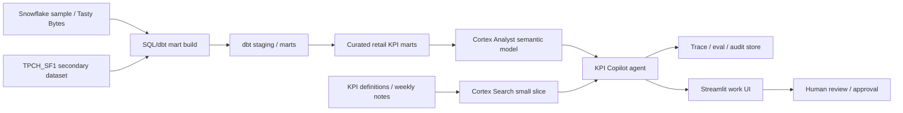

# 02_アーキテクチャ方針

## 選定案

選定案は Retail Operations KPI Copilot。

小売・流通の店舗運営を題材に、売上、粗利、在庫、欠品、販促、週報を横断して、自然言語でKPI確認と要因調査を行う。

## 基本構成

## Snowflake-native first

第一候補は Snowflake-native。

- 構造化KPI: Cortex Analyst
- 用語定義・週報・軽い文書検索: Cortex Search
- Snowflake内の統合エージェント: Cortex Agents
- UI: Streamlit
- 変換・テスト・docs: dbt

Snowflakeが使えない場合にアプリ側で黙ってローカル実行へ切り替えない。`local_explicit_test` は明示選択した時だけ使い、Snowflake live modeでは接続失敗・権限不足・SQL失敗をそのままエラーとして見せる。

LangGraph / OpenAI Agents SDK は、Snowflakeが管理する範囲とアプリ側が所有する範囲を比較する appendix として扱う。初期MVPの主役にはしない。

## なぜこの構成か

公開情報からは、以下の技術テーマが学習題材として有用に見える。

- Snowflake / dbt を使ったデータ基盤モダナイゼーション
- Snowflake Intelligence / Cortex Analyst / Cortex Search / Cortex Agents への関心
- 流通・小売での売上、在庫、週報、BI、異常検知、需要予測との接点
- 生成AI導入における評価、ガードレール、運用、コスト最適化

したがって、単独のRAGチャットより、データ基盤上の semantic KPI copilot の方が設計学習として価値が高い。

## MVPの代表フロー

1. ユーザーが「先週、東京エリアの粗利率が落ちた理由を見て」と聞く
2. Agent が structured KPI question と判定する
3. planner が metric、grain、filter、time window を抽出する
4. Cortex Analyst またはMVP plannerが semantic model 契約に沿ったSQLと結果を返す
5. Agent が行数、粒度、必須フィルタ、信頼度を確認する
6. 必要なら Cortex Search で KPI定義や週報メモを引く
7. 回答、SQL、根拠、安全停止理由を trace に保存する
8. Follow-up「大阪は？」で前回の metric/time context を再利用する

## 設計上の禁止事項

- free-form SQL agent を主役にしない
- LLMにraw transaction rowsを丸ごと渡さない
- 根拠なしの要因推定をしない
- unsupported / ambiguous question を無理に回答しない
- 本番書き込みや通知は human approval なしで実行しない
